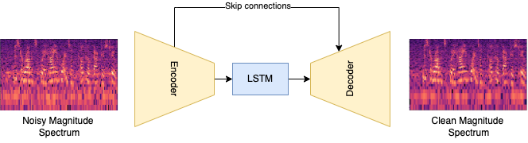

# ECE 251C - Speech Enhancement using Convolutional - Recurrent Neural Networks and Wavelet Pooling

In this project, we present an end-to-end data-driven system for enhancing the quality of speech signals using a convolutional-recurrent neural network. We present a quantitative and qualitative analysis of our model's performance on a real-world noisy speech dataset and evaluate our proposed system’s performance using several metrics such as SNR, PESQ, etc. We have employed wavelet pooling mechanism instead of max-pooling layer in the convolutional layer and compared the performances of these variants.


# Dataset 

We use the [CSR-WSJ01 dataset](https://catalog.ldc.upenn.edu/LDC93s6a) for clean signals and use noise recordings from [ACE corpus dataset](http://www.ee.ic.ac.uk/naylor/ACEweb/index.html).

The CSR-WSJ dataset is in the wv1/wv2 file format. We use the conversion tools available [here](https://www.ldc.upenn.edu/language-resources/tools/sphere-conversion-tools) to convert to sphere (sph) file format followed by conversion to .wav using this [repo](https://github.com/mcfletch/sphfile). Steps to set up the sphere conversion tool (wv1/2 - sph) -
1. gcc -o sph2pipe *.c -lm 
2. Add executable to path - PATH="$(pwd):$PATH"

Folder structure for data - 
```
-data 
  -clean_data (contains all dataset from [CSR-WSJ01 dataset](https://catalog.ldc.upenn.edu/LDC93s6a) as sph files)
  -train_set.txt
  -val_set.txt
  -test_set.txt
```

# Model

The two models we implement are based on the following 2 architectures - 

-----------------------------------------------------------------------------------------------------------------------------------------------------------


# Instructions to run code

1. The 2 models can be trained via train.py configured by yaml file like in configs.
2. Evalaute model on test set using generateMetrics.py 
3. Use the plot_curves.ipynb to generate loss / evaluation plots.


 
 
